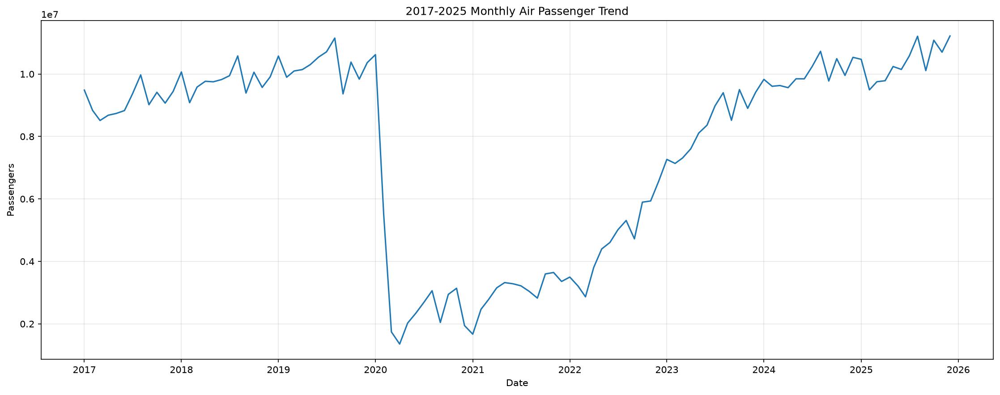
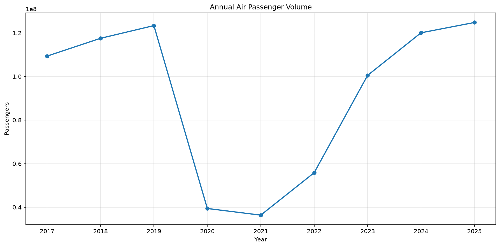
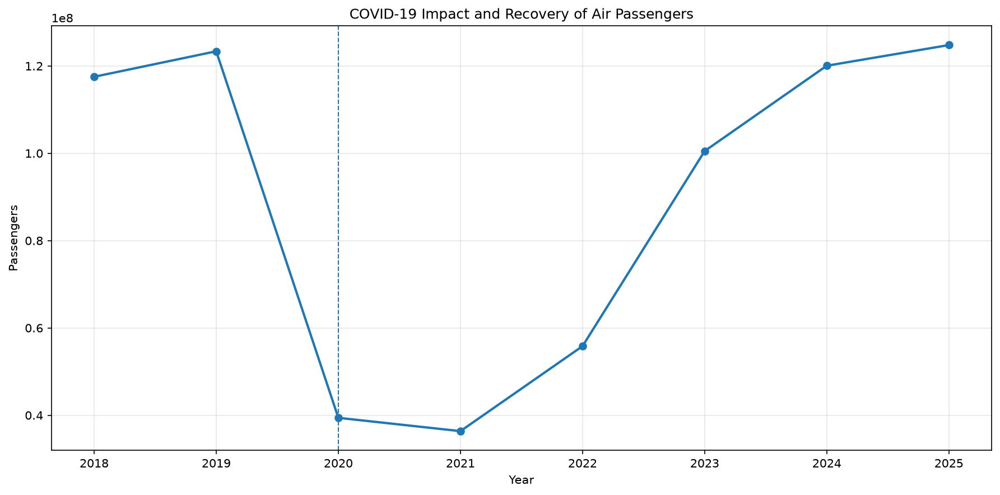
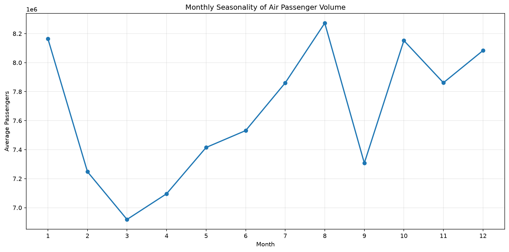

# 2017~2025년 항공 여객 시계열 분석

## 1. 분석 주제

### 2017~2025년 국내 항공 여객 수의 시계열 변화와 코로나19 이후 회복 및 계절성 분석

2017년부터 2025년까지의 월별 항공 여객 데이터를 활용하여 시간의 흐름에 따른 항공 여객 수의 변화를 분석하였다.

특히 장기적인 증가 추세, 코로나19 발생에 따른 급격한 변화, 코로나19 이후의 회복 과정, 월별 계절성을 중심으로 분석하였다.

「2017년무터 2025년까지 국내 항공 여객 수의 변화와 계절성 분석]

---

## 2. 분석 질문

본 분석에서는 다음과 같은 질문을 설정하였다.

1. 2017년부터 2025년까지 항공 여객 수는 어떤 장기적인 추세를 보이는가?
2. 코로나19 발생 이후 항공 여객 수는 얼마나 감소했으며, 이후 어떻게 회복되었는가?
3. 월별 항공 여객 수에는 반복적으로 나타나는 계절적 패턴이 존재하는가?
4. 코로나19 이전인 2019년과 비교했을 때 2025년 항공 여객 수는 어느 수준까지 회복되었는가?

---

## 3. 데이터 설명

### 3.1 데이터 출처 및 수집 방법

본 프로젝트에서는 **항공정보포털시스템의 항공통계 상세조회**에서 제공되는 항공통계 데이터를 활용하였다.

2017년부터 2025년까지의 기간을 대상으로 연도별 항공통계 Excel 파일을 수집하였으며, 각 연도의 데이터를 Python을 이용하여 하나의 데이터셋으로 통합하였다.

사용한 원본 데이터는 다음과 같다.

* 2017년 항공통계
* 2018년 항공통계
* 2019년 항공통계
* 2020년 항공통계
* 2021년 항공통계
* 2022년 항공통계
* 2023년 항공통계
* 2024년 항공통계
* 2025년 항공통계

분석에서는 전체 항공 여객 규모의 변화를 확인하기 위해 `항공사명`이 `전체 합계`인 데이터를 추출하였다.

데이터 수집 및 분석에 사용한 기간은 **2017년 1월부터 2025년 12월까지**이다.

---

### 3.2 데이터 구성

분석에 사용한 주요 변수는 다음과 같다.

| 변수    | 설명            |
| ----- | ------------- |
| 항공사명  | 항공사 또는 합계 구분  |
| 년월    | 월별 데이터 시점     |
| 여객(명) | 해당 월의 항공 여객 수 |
| 연도    | 원본 데이터의 연도 구분 |

`항공사명 = 전체 합계` 데이터를 사용함으로써 개별 항공사가 아닌 전체 항공 여객 규모의 변화를 분석하였다.

---

### 3.3 데이터 규모

* 분석 기간: **2017년 1월 ~ 2025년 12월**
* 데이터 포인트: **총 108개월**
* 분석 대상: **월별 항공 여객 수**
* 날짜 결측치: **0개**
* 여객 수 결측치: **0개**

총 108개의 월별 데이터를 사용하였으므로 최소 100개 이상의 데이터 포인트가 필요한 시계열 분석 조건을 충족한다.

---

### 3.4 데이터 전처리

원본 데이터의 `년월` 값은 `2017년 01월`과 같은 문자열 형태였기 때문에 분석을 위해 날짜 형식으로 변환하였다.

예:

```text
2017년 01월 → 2017-01-01
2017년 02월 → 2017-02-01
```

이후 다음과 같은 전처리 과정을 수행하였다.

1. `항공사명 = 전체 합계` 데이터 추출
2. `년월` 데이터를 날짜 형식으로 변환
3. 월별 여객 수를 숫자형으로 변환
4. 날짜 기준으로 오름차순 정렬
5. 날짜 및 여객 수의 결측값 확인
6. 연도 및 월 컬럼 생성
7. 월별 시계열 데이터 구성

전처리 후 최종 분석 데이터는 2017년 1월부터 2025년 12월까지 총 108개의 월별 데이터로 구성하였다.

---

### 3.5 결측치 및 이상치 처리

결측값을 확인한 결과 날짜와 여객 수 모두 결측값이 존재하지 않았다.

따라서 결측값에 대해 평균 대체나 보간 등의 별도 처리를 수행하지 않고 원본 데이터를 그대로 사용하였다.

이상치 여부도 함께 확인하였다.

특히 2020년에는 전년 대비 항공 여객 수가 약 **68.06% 감소**하는 큰 변화가 나타났다.

그러나 이 값은 단순한 입력 오류나 데이터 수집 오류로 판단하지 않았다. 전체 시계열에서 실제로 나타난 항공 여객 수요의 급격한 변화로 판단하였기 때문에 해당 데이터를 삭제하거나 임의로 보정하지 않았다.

즉, 값이 크게 변화했다는 이유만으로 데이터를 이상치로 제거하지 않고, 시계열상의 의미와 원본 데이터를 함께 확인하여 실제 현상으로 판단되는 값은 분석에 포함하였다.

---

## 4. 분석 방법

Python의 `pandas`와 `matplotlib`를 활용하여 다음과 같은 분석을 수행하였다.

### 4.1 월별 항공 여객 수 시계열 분석

2017년 1월부터 2025년 12월까지 월별 항공 여객 수를 시간 순서대로 배열하여 전체적인 추세와 급격한 변화를 확인하였다.

이를 통해 코로나19 이전의 증가 추세와 2020년 이후의 감소 및 회복 흐름을 시각적으로 확인하였다.

---

### 4.2 연도별 총 여객 수 분석

각 연도에 포함된 12개월의 여객 수를 합산하여 연도별 총 항공 여객 수를 계산하였다.

이를 통해 연도 단위에서 장기적인 변화와 코로나19 전후의 규모 차이를 비교하였다.

---

### 4.3 전년 대비 증감률

각 연도의 총 여객 수를 전년도와 비교하여 전년 대비 증감률(YoY)을 계산하였다.

전년 대비 증감률은 다음과 같이 계산하였다.

```text
전년 대비 증감률(%)
= (현재 연도 여객 수 - 전년도 여객 수)
  / 전년도 여객 수 × 100
```

이를 통해 특정 연도에 항공 여객 수가 얼마나 증가하거나 감소했는지 확인하였다.

---

### 4.4 코로나19 전후 변화 분석

2019년을 코로나19 이전의 비교 기준으로 설정하고 2020년 이후 항공 여객 수의 변화를 비교하였다.

특히 2019년 → 2020년의 급격한 감소와 2022년 이후의 회복 과정을 중심으로 분석하였다.

---

### 4.5 코로나19 이전 대비 회복 수준 분석

2025년의 연간 총 여객 수를 코로나19 이전인 2019년의 연간 총 여객 수와 비교하였다.

이를 통해 항공 여객 수가 코로나19 이전 수준까지 회복되었는지를 확인하였다.

---

### 4.6 월별 평균을 이용한 계절성 분석

1월부터 12월까지 같은 월에 해당하는 데이터를 여러 연도에 걸쳐 평균하여 월별 평균 여객 수를 계산하였다.

이를 통해 특정 월에 반복적으로 여객 수가 높거나 낮게 나타나는 월별 패턴을 확인하였다.

---

### 4.7 시각화

분석 결과를 이해하기 쉽도록 다음과 같은 시각화를 작성하였다.

1. 월별 항공 여객 추이
2. 연도별 총 항공 여객 수
3. 코로나19 전후 항공 여객 변화
4. 월별 평균 항공 여객 수

---

## 5. 시각화 결과

### 5.1 월별 항공 여객 추이

2017년부터 2025년까지 월별 항공 여객 수의 전체적인 변화를 나타낸 그래프이다.



그래프에서 2017~2019년의 증가 흐름, 2020~2021년의 급격한 감소, 2022년 이후의 회복 흐름을 확인할 수 있다.

---

### 5.2 연도별 총 항공 여객 수

연도별 총 여객 수의 변화를 비교하였다.



2019년까지 여객 수가 증가했으나 2020년을 기점으로 큰 폭의 감소가 나타났다.

이후 2022년부터 증가세가 나타났으며 2025년에는 2019년의 연간 총 여객 수를 넘어섰다.

---

### 5.3 코로나19 전후 변화

코로나19 발생 전후의 항공 여객 수 변화를 별도로 시각화하였다.



2019년과 2020년 사이에 가장 큰 감소가 나타났으며, 이후 2022년부터 회복 속도가 빨라지는 모습을 확인할 수 있다.

---

### 5.4 월별 계절성

전체 기간의 월별 평균 여객 수를 계산하여 월별 변동을 확인하였다.



전체 기간 평균을 기준으로 8월의 평균 여객 수가 가장 높았으며 3월이 가장 낮게 나타났다.

---

## 6. 주요 분석 결과

### 6.1 코로나19 이전의 증가 추세

2017년 총 여객 수는 **109,361,974명**이었으며,

* 2018년: **117,525,898명**
* 2019년: **123,366,608명**

으로 증가하였다.

전년 대비 증감률은 다음과 같다.

* 2017 → 2018: **+7.47%**
* 2018 → 2019: **+4.97%**

따라서 데이터에서 2017~2019년 동안 항공 여객 수가 지속적으로 증가하는 흐름을 확인할 수 있었다.

---

### 6.2 코로나19의 급격한 영향

2019년 총 여객 수는 **123,366,608명**이었지만 2020년에는 **39,403,960명**으로 감소하였다.

전년 대비 변화율은 다음과 같다.

**-68.06%**

즉, 2019년에서 2020년 사이에 전체 항공 여객 수가 약 68% 감소하였다.

이는 분석 기간 중 가장 큰 연간 감소폭이다.

---

### 6.3 2021년까지의 침체

2021년 총 여객 수는 **36,356,010명**으로 2020년보다도 **7.74% 감소**하였다.

따라서 데이터상 코로나19로 인한 급격한 감소가 2020년에 발생한 후에도 2021년까지 낮은 수준이 이어졌음을 확인할 수 있다.

---

### 6.4 2022년 이후 회복

2022년부터 항공 여객 수가 다시 증가하였다.

연도별 전년 대비 증감률은 다음과 같다.

* 2022년: **+53.56%**
* 2023년: **+80.03%**
* 2024년: **+19.45%**
* 2025년: **+3.94%**

특히 2023년에는 전년 대비 **80.03% 증가**하여 분석 기간 중 회복 구간에서 가장 높은 증가율을 기록하였다.

---

### 6.5 2025년 코로나19 이전 수준 회복

2019년 총 여객 수는 **123,366,608명**이었고 2025년에는 **124,793,082명**을 기록하였다.

따라서 2025년 총 여객 수는 2019년보다 약 **1,426,474명 많았다.**

2019년 대비 2025년의 수준은 약 **101.16%**로 계산되며, 연간 총 여객 수 기준으로 코로나19 이전 수준을 넘어선 것으로 나타났다.

---

### 6.6 월별 계절성

전체 기간의 월별 평균 여객 수를 분석한 결과 다음과 같은 차이가 나타났다.

* 가장 높은 월: **8월, 평균 8,272,697명**
* 가장 낮은 월: **3월, 평균 6,918,879명**

따라서 월별 평균에서도 일정한 차이가 나타났으며, 항공 여객 수가 연도별 장기 추세뿐만 아니라 월별 변동 패턴도 보이는 것을 확인하였다.

---

## 7. 연도별 분석 결과

|   연도 |      총 여객 수 | 전년 대비 증감률 |
| ---: | ----------: | --------: |
| 2017 | 109,361,974 |         - |
| 2018 | 117,525,898 |    +7.47% |
| 2019 | 123,366,608 |    +4.97% |
| 2020 |  39,403,960 |   -68.06% |
| 2021 |  36,356,010 |    -7.74% |
| 2022 |  55,828,355 |   +53.56% |
| 2023 | 100,508,691 |   +80.03% |
| 2024 | 120,058,371 |   +19.45% |
| 2025 | 124,793,082 |    +3.94% |

---

## 8. 인사이트

### 인사이트 1. 코로나19를 기준으로 항공 여객 수의 추세가 크게 변화하였다.

2017~2019년에는 연간 총 여객 수가 증가했지만 2020년에는 전년 대비 **68.06% 감소**하였다.

따라서 전체 시계열에서 2020년을 기준으로 뚜렷한 구조적 변화가 나타났음을 확인할 수 있다.

---

### 인사이트 2. 항공 여객 수의 회복은 2022년부터 본격적으로 나타났다.

2022년에는 전년 대비 **53.56%**, 2023년에는 **80.03%** 증가하였다.

이후 2024년과 2025년에도 증가세가 이어졌다.

따라서 데이터에서는 2022년 이후 항공 여객 수가 빠른 속도로 회복되는 흐름을 확인할 수 있다.

---

### 인사이트 3. 2025년 연간 항공 여객 수는 코로나19 이전 수준을 넘어섰다.

2019년에는 **123,366,608명**, 2025년에는 **124,793,082명**으로 나타났다.

2025년의 연간 총 여객 수가 2019년보다 약 **1.16% 높은 수준**이므로, 연간 총량 기준으로는 코로나19 이전 수준을 회복한 것으로 볼 수 있다.

---

### 인사이트 4. 월별 항공 여객 수에서도 계절적 차이가 나타났다.

전체 기간의 월별 평균을 비교한 결과 8월이 **8,272,697명**으로 가장 높았고 3월이 **6,918,879명**으로 가장 낮았다.

이는 항공 여객 수가 장기적인 연도별 추세뿐만 아니라 월별로도 차이가 나타나는 것을 보여준다.

다만 본 분석만으로 특정 월의 차이가 발생한 구체적인 원인을 단정할 수는 없다.

---

## 9. 관찰 결과와 해석의 구분

본 분석에서는 실제 데이터에서 확인할 수 있는 사실과 그에 대한 해석을 구분하였다.

### 데이터에서 직접 확인한 사실

* 2017~2019년 연간 총 여객 수 증가
* 2020년 전년 대비 68.06% 감소
* 2021년에도 감소세 지속
* 2022년 이후 증가세 전환
* 2023년 전년 대비 80.03% 증가
* 2025년 연간 총 여객 수가 2019년보다 높음
* 월별 평균에서 8월이 가장 높고 3월이 가장 낮음

### 해석

* 2020년은 전체 시계열에서 구조적 변화가 나타난 시점으로 볼 수 있다.
* 2022년 이후에는 항공 여객 수의 회복 흐름이 나타났다고 해석할 수 있다.
* 2025년에는 연간 총 여객 수 기준으로 코로나19 이전 수준을 회복한 것으로 판단할 수 있다.
* 월별 평균 차이를 통해 계절적 변동 가능성을 확인할 수 있다.

단, 본 데이터만으로 특정 변화의 원인을 통계적으로 증명한 것은 아니므로 원인에 대해서는 해석의 범위를 제한하였다.

---

## 10. 결론

2017~2025년 국내 항공 여객 데이터를 시계열 분석한 결과, 코로나19 이전에는 항공 여객 수가 꾸준히 증가하는 추세를 보였으나 2020년에는 전년 대비 **68.06% 급감**하였다.

2021년에도 낮은 수준이 이어졌지만 2022년부터 회복세가 나타났으며, 2023년에는 전년 대비 **80.03% 증가**하면서 빠른 회복이 확인되었다.

2025년에는 총 여객 수가 **124,793,082명**으로 2019년의 **123,366,608명**을 넘어섰다.

또한 전체 기간의 월별 평균을 비교한 결과 8월의 평균 여객 수가 가장 높고 3월이 가장 낮게 나타나 월별 변동 패턴도 확인하였다.

따라서 본 분석에서는 항공 여객 수의 장기 추세뿐만 아니라 코로나19 시기의 급격한 구조적 변화, 이후의 회복 과정, 월별 변동 패턴까지 확인할 수 있었다.

---

## 11. 한계점

첫째, 본 분석은 전체 항공 여객 수를 중심으로 수행했기 때문에 국내선과 국제선, 개별 항공사, 공항별 차이를 세부적으로 비교하지 않았다.

둘째, 항공 여객 수의 변화를 코로나19와 월별 변동 중심으로 분석했지만 유가, 환율, 경기 상황, 여행 수요, 국제선 운항 정책 등의 외부 요인은 별도로 반영하지 않았다.

셋째, 월별 평균을 이용하여 계절적 패턴을 확인했지만 통계적인 계절성 검정이나 시계열 분해를 수행한 것은 아니다.

넷째, 본 분석은 과거 데이터를 기반으로 한 시계열 탐색에 초점을 맞추었으며 미래 여객 수를 예측하는 예측 모델은 포함하지 않았다.

향후에는 국내선·국제선 및 항공사별 데이터를 세분화하고 이동평균, 시계열 분해 또는 예측 모델 등을 적용하여 항공 수요의 변화 요인을 보다 구체적으로 분석할 수 있다.

---

## 12. 프로젝트 파일 구성

```text
M1-1/
│
├── 원본 항공통계 Excel 파일
│   ├── 항공통계상세조회 2017 .xlsx
│   ├── 항공통계상세조회 2018 .xlsx
│   ├── 항공통계상세조회 2019 .xlsx
│   ├── 항공통계상세조회 2020 여객.xlsx
│   ├── 항공통계상세조회 2021.xlsx
│   ├── 항공통계상세조회 2022 .xlsx
│   ├── 항공통계상세조회 2023 .xlsx
│   ├── 항공통계상세조회 2024.xlsx
│   └── 항공통계상세조회 2025.xlsx
│
├── 항공통계_2017_2025_통합.xlsx
│
├── merge_excel.py
├── analysis.py
├── REPORT.md
├── README.md
├── requirements.txt
├── .gitignore
│
└── results/
    ├── 01_월별_항공여객_추이.png
    ├── 02_연도별_항공여객.png
    ├── 03_코로나_전후_항공여객.png
    ├── 04_월별_계절성.png
    ├── 연도별_항공여객_분석.xlsx
    ├── 월별_계절성_분석.xlsx
    └── 정제된_항공여객_시계열.xlsx
```

원본 Excel 파일과 분석 과정에서 생성되는 Excel 결과 파일은 `.gitignore`를 통해 GitHub 저장소에서 제외하였다.

GitHub에서는 코드, 보고서, 시각화 결과를 중심으로 확인할 수 있으며, 원본 데이터의 수집 방법은 본 보고서에 기록하였다.

---

## 13. 실행 방법

### 13.1 필요한 라이브러리 설치

프로젝트 폴더에서 다음 명령어를 실행한다.

```bash
pip install -r requirements.txt
```

`requirements.txt`에는 분석에 필요한 Python 라이브러리와 버전 정보가 기록되어 있다.

### 13.2 데이터 통합

연도별 원본 Excel 파일이 프로젝트 폴더에 있는지 확인한 후 다음 명령어를 실행한다.

```bash
python merge_excel.py
```

실행하면 여러 연도의 Excel 데이터가 하나의 통합 데이터셋으로 구성된다.

### 13.3 시계열 분석 및 시각화

다음 명령어를 실행한다.

```bash
python analysis.py
```

실행 후 `results` 폴더에 분석 결과와 시각화 파일이 생성된다.

---

## 14. 사용 기술

* Python
* Pandas
* OpenPyXL
* Matplotlib
* Microsoft Excel
* Git
* GitHub

---

## 15. AI 활용 및 검증

### 15.1 AI를 활용한 작업

본 프로젝트에서는 AI를 분석 과정의 보조 도구로 활용하였다.

#### 데이터 전처리 및 코드 작성

* 여러 연도별 Excel 파일을 하나의 데이터셋으로 통합하는 Python 코드 작성에 활용하였다.
* 날짜 형식 변환 방법을 검토하였다.
* `항공사명 = 전체 합계` 데이터를 추출하는 방법을 검토하였다.
* 여객 수를 숫자형 데이터로 변환하고 날짜순으로 정렬하는 전처리 방법을 검토하였다.

#### 시계열 분석 방법 검토

* 연도별 총 여객 수를 계산하는 방법을 검토하였다.
* 전년 대비 증감률(YoY)을 계산하는 방법을 검토하였다.
* 코로나19 전후의 변화와 회복 수준을 비교하는 방법을 검토하였다.
* 월별 평균을 이용하여 계절적 패턴을 확인하는 방법을 검토하였다.

#### 시각화

* 월별 항공 여객 추이 그래프 작성
* 연도별 총 항공 여객 비교 그래프 작성
* 코로나19 전후 변화 그래프 작성
* 월별 평균 계절성 그래프 작성

등의 Python 코드 작성 과정에서 AI를 활용하였다.

#### 결과 해석 및 보고서 작성

그래프와 계산 결과를 바탕으로 분석 질문에 답할 수 있는 해석을 정리하고 보고서의 구조와 문장을 작성하는 과정에서도 AI를 활용하였다.

단, AI가 제시한 결과를 그대로 사용하지 않고 실제 Python 실행 결과와 원본 데이터를 확인한 후 최종 결과를 작성하였다.

---

### 15.2 AI를 활용한 이유

반복적인 데이터 전처리와 시각화 코드를 효율적으로 작성하고, 시계열 분석에 사용할 수 있는 기본적인 분석 방법을 검토하기 위해 AI를 활용하였다.

특히 여러 개의 연도별 Excel 파일을 동일한 구조로 통합하고 108개의 월별 시계열 데이터로 변환하는 과정에서 코드 작성 보조 도구로 활용하였다.

또한 분석 결과를 보고서 형식으로 정리하고 데이터에서 확인되는 사실과 해석을 구분하는 데 활용하였다.

---

### 15.3 AI 결과 검증 방법

AI가 작성하거나 제안한 코드와 분석 방법은 다음과 같은 방식으로 직접 검증하였다.

1. Python 코드를 실제로 실행하여 오류 여부를 확인하였다.
2. 통합 데이터가 2017년 1월부터 2025년 12월까지 총 **108개월**인지 확인하였다.
3. 날짜와 여객 수 데이터의 결측값이 없는지 확인하였다.
4. 연도별 총 여객 수를 Python으로 직접 계산하였다.
5. 전년 대비 증감률을 Python으로 직접 계산하였다.
6. 월별 평균 여객 수를 계산하여 월별 패턴을 확인하였다.
7. 계산된 수치가 그래프의 추세와 일치하는지 비교하였다.
8. 2020년의 급격한 감소가 데이터 오류인지 확인하기 위해 원본 데이터와 분석 결과를 비교하였다.
9. 2019년과 2025년의 총 여객 수를 직접 비교하여 코로나19 이전 수준 회복 여부를 확인하였다.

따라서 최종 보고서의 수치와 해석은 AI의 답변을 그대로 사용한 것이 아니라 **실제 Python 실행 결과와 원본 데이터에 기반하여 검증한 후 작성하였다.**

---

## 16. 데이터 및 분석 재현성

본 프로젝트는 동일한 원본 데이터를 사용하면 동일한 분석 과정을 재현할 수 있도록 Python 코드를 작성하였다.

실행 순서는 다음과 같다.

```bash
pip install -r requirements.txt
python merge_excel.py
python analysis.py
```

`merge_excel.py`는 연도별 원본 데이터를 통합하고, `analysis.py`는 통합된 데이터를 이용하여 시계열 분석과 시각화를 수행한다.

원본 Excel 데이터는 GitHub 저장소 용량 및 관리상의 이유로 `.gitignore`에 등록하여 저장소에서 제외하였다.

따라서 본 프로젝트에서는 **데이터 출처와 수집 방법을 REPORT.md에 기록하고, 분석 코드와 결과 시각화를 GitHub에 제공하는 방식으로 재현성을 확보하였다.**

